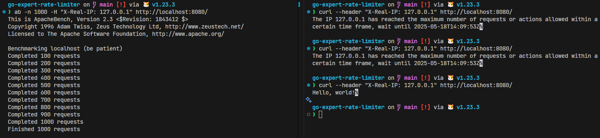
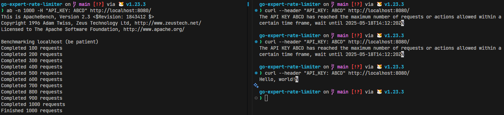
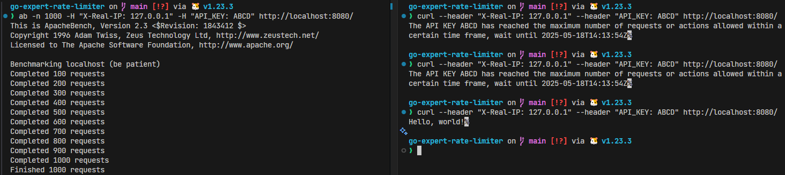
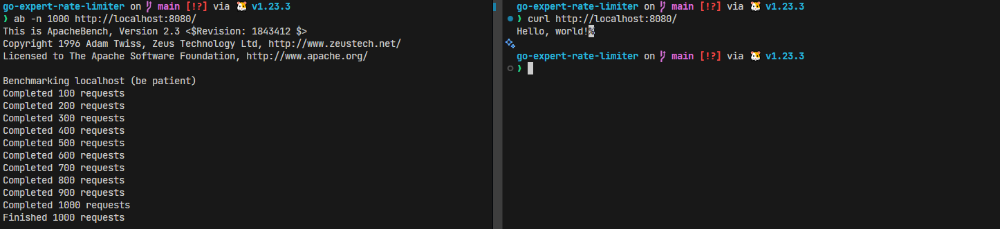
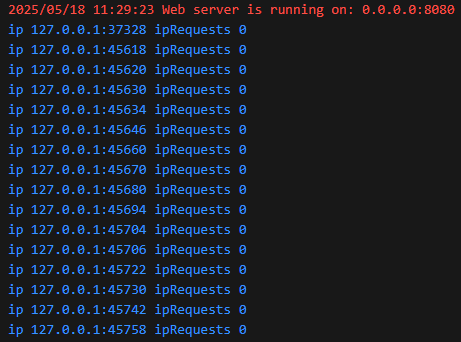

# Tests

## Metodologia

Para testar as funcionalidades de rate limiter do servidor, utilizamos duas janelas de terminal,
onde uma janela será a responsável por diversas chamadas em sequência para forçar o limite
acontecer, e a outra por efetuar chamadas simples após o limite ser atingido.

Abaixo estão imagens que evidenciam o funcionamento do rate limit no servidor para os diferentes
casos de uso. A janela a esquerda demonstra as chamadas ao servidor utilizando a ferramenta `ab`,
já a janela a direita demonstra duas chamadas após o limite ter sido atingido e logo em seguida uma
terceira chamada após o limite ter sido liberado novamente.

### Testes por IP

### Testes por TOKEN

### Testes por IP e TOKEN

### Testes sem headers

## Análise dos resultados

Podemos ver nas evidências que a funcionalidade de rate limit funciona corretamente quando os 
headers são fornecidos conforme o esperado pela ferramenta, porém, chamadas sem os headers 
configurados não são bloqueadas, o que podemos considerar como uma vulnerabilidade do sistema.

Analisando mais a fundo o funcionamento da nossa funcionalidade podemos ver que a implementação
utiliza a pacote http da biblioteca padrão do go, o que nos garante que a informação do IP da 
chamada será obtida corretamente, porém, como a aplicação depende diretamente de informações
fornecidas pelo cliente, um cliente mal intencionado poderia facilmente gerar informações falsas
para burlar o sistema de limite.

A situação citada acima acontece, pois as ferramentas que estamos utilizando(`ab` e 
`curl`) estão fornecendo informações aleatórias para identificar o IP da chamada. Podemos verificar
nos logs do servidor que IPs no formato `<IP>:<PORT>` são fornecidos quando o header de 
identificação do IP não é fornecido na chamada, conforme imagem abaixo:

## Conclusão

IPs são identificadores em que não temos o controle e qualquer cliente pode falsificar essa 
informação no momento da chamada, o problema acima pode ser facilmente mitigado alterando os
requisitos para exigir o uso do TOKEN para todos os requests, visto que esta é uma informação que
está no controle dos proprietários do software, onde sua disponibilização possa ser verificada e
revogada caso utilizado de forma mal intencionada.

De acordo com as informações fornecidas nos requisitos, concluo que a funcionalidade está de acordo
com a proposta. Caso ainda assim entendam que algum requisito não foi atendido, peço a gentileza que
forneçam evidências dos testes para que facilite o entendimento do que está em desacordo, visto que
a plataforma da Full Cycle não oferece ferramentas para questionamento e informações como a da 
imagem abaixo não deixam muito claro os passos que foram executados para reproduzir o possível 
problema.

Conforme evidências acima, todos os cenários solicitados funcionaram de acordo com o esperado.
